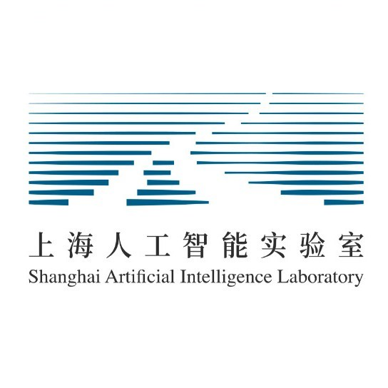
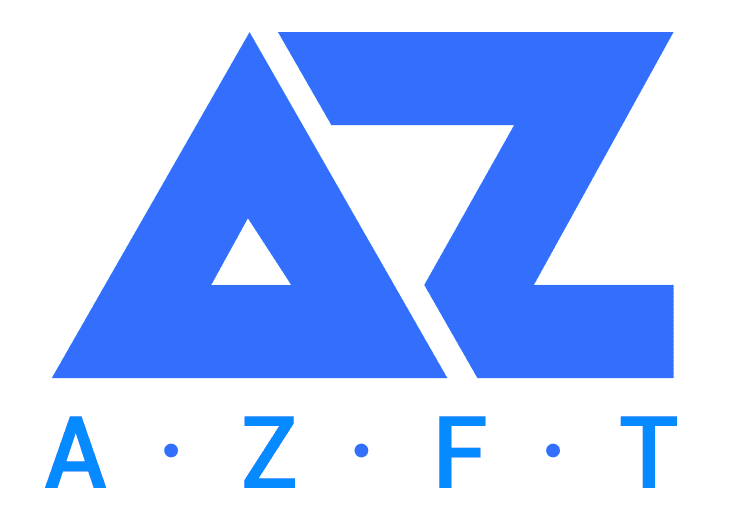

News
----------

Education
----------

&ensp;The Chinese University of Hong Kong (CUHK)
:   &nbsp;&ensp;August 2019 - July 2023 (Expected)
:   &nbsp;&ensp;Ph.D. in Information Engineering

&ensp;Zhejiang University (ZJU)
:   &nbsp;&ensp;August 2015 - July 2019
:   &nbsp;&ensp;Major: B.E. in Information Engineering
:   &nbsp;&ensp;Minor: Advanced Honor Class of Engineering Education (ACEE), Chu Kochen Honors College

Publications
----------

Research Projects
----------

&ensp;MMDetection3D: The Next Generation Platform for General 3D detection
:   &nbsp;&ensp;MMDetection3D Contributors
:   &nbsp;&ensp;May 2020 – Now
:   &nbsp;&ensp;[\[Code\]](https://github.com/open-mmlab/mmdetection3d)&nbsp;[\[Doc\]](https://mmdetection3d.readthedocs.io/en/latest/)

Experience
----------

&ensp;Adjunct Researcher, Sensetime & Visiting Scholar, Shanghai AI Laboratory
:   &nbsp;&ensp;July 2020 - June 2021 & July 2021 - Now
:   &nbsp;&ensp;Focus: The next-generation platform for general 3D object detection

&ensp;Adjunct Researcher, Sensetime
:   &nbsp;&ensp;Nov. 2019 - June 2020. Advisor: Conghui He, Zhe Wang, Jianping Shi
:   &nbsp;&ensp;Focus: Efficient annotation of LiDAR point clouds, development of LiDAR perception system

&ensp;Junior Research Assistant, The Chinese University of Hong Kong (CUHK)
:   &nbsp;&ensp;Feb. 2019 - May 2020. Advisor: Dahua Lin
:   &nbsp;&ensp;Focus: Real-time 3D object detection in autonomous driving

&ensp;Research Intern, Alibaba-ZJU Joint Institute of Frontier Technologies (AZFT)
:   &nbsp;&ensp;Dec. 2017 - June 2019. Advisor: Zicheng Liao, Gang Wang
:   &nbsp;&ensp;Focus: Joint analysis of 2D Images and 3D Shapes, machine learning approaches

Selected Awards
----------
- 1st place of vision-only track and best PKL award of overall track, [NuScenes 3D Detection Challenge](https://www.nuscenes.org/object-detection?externalData=all&mapData=all&modalities=Any), NeurIPS 2020
- Runner-up of [NuScenes LiDAR Segmentation Challenge](https://www.nuscenes.org/lidar-segmentation?externalData=all&mapData=all&modalities=Any), NeurIPS 2020
- Gold Medal of Kaggle Competition (Top 1% of [Lyft 3D Detection Challenge](https://www.nuscenes.org/lidar-segmentation?externalData=all&mapData=all&modalities=Any)), NeurIPS 2019
- Hong Kong PhD Fellowship (HKPFS), 2019
- Chu Kochen Scholarship (Highest scholarship at Zhejiang University), 2018
- Top 10 Students of ZJU (Highest honor for 5 undergraduates/graduates), 2018
- National Scholarship (1.5%), 2017-2018
- First Prize in Physics Competition for Undergraduate, 2017

Teaching
----------
- Computer Vision (Undergraduate Course), Winter 2018 @ ZJU
- IERG2080: Introduction to Systems Programming, Fall 2020 @ CUHK
- ESTR2308: Probability Models and Applications (Elite Students), Spring 2021 @ CUHK

Miscellaneous
----------
**Academic Services**  
I served as a reviewer for CVPR, ICCV, ECCV, ICLR.

**Hobbies**  
Love: Basketball (I am a big fan of [Stephen Curry](https://en.wikipedia.org/wiki/Stephen_Curry) and [Tracy McGrady](https://en.wikipedia.org/wiki/Tracy_McGrady)), music/singing and good at Chinese calligraphy (learned from [MA Liangchen](https://baike.baidu.com/item/%E9%A9%AC%E8%89%AF%E8%BE%B0/5438872) and [MA Shanshuang](https://baike.baidu.com/item/%E9%A9%AC%E5%96%84%E5%8F%8C/5954206)).
