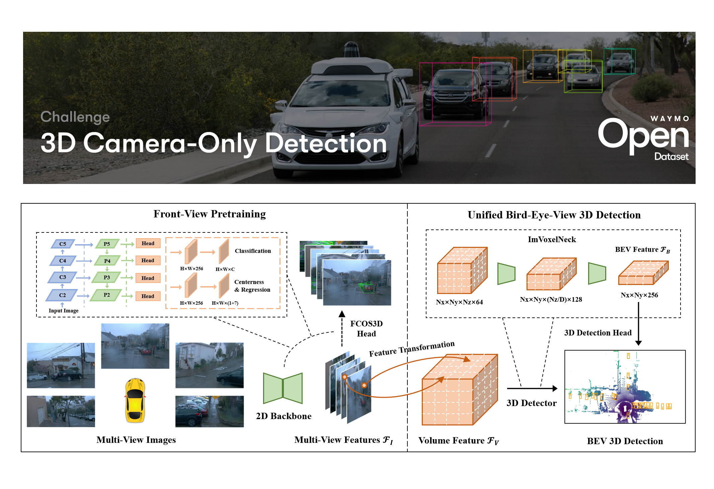
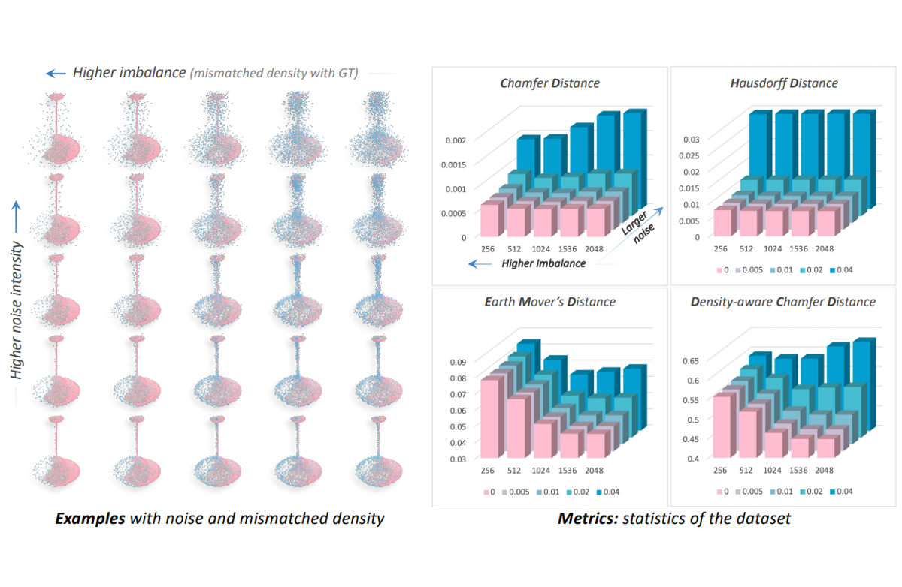

I am a Ph.D. student of [MMLab](http://mmlab.ie.cuhk.edu.hk/) (Multimedia Laboratory), [The Chinese University of Hong Kong](https://www.cuhk.edu.hk/english/index.html), supervised by [Dahua Lin](http://dahua.site/). Previously I spent four wonderful years and obtained my Bachelor's Degree at [Zhejiang University](https://www.zju.edu.cn/english/). I am excited about all the vision or AI technologies that can change people's lifestyles, for example, building intelligent agents that can interact with us. My current research is mainly focused on general 3D perception, including different modalities, tasks and scenarios. I am also interested in other extensive 3D vision research and their robotic applications.

News
----------
- \[2022/07\] DfM, our recent study on 3D perception from monocular videos, is accepted by [ECCV 2022](https://eccv2022.ecva.net/).
- \[2022/06\] A simple multi-view baseline, MV-FCOS3D++, obtained the runner-up in the [Waymo Camera-Only 3D Detection Challenge](https://cvpr2022.wad.vision/) with few bells-and-whistles. Code will be available soon.
- \[2021/10\] [FCOS3D](https://arxiv.org/abs/2104.10956) got the best paper award on the [ICCV 3DODI workshop](https://sites.google.com/unitn.it/3dodi/home)! Thanks for the recognition!
- \[2021/09\] One paper is accepted by [NeurIPS 2021](https://nips.cc/).
- \[2021/09\] [PGD](https://arxiv.org/abs/2107.14160), our follow-up work of FCOS3D, is accepted by [CoRL 2021](https://www.robot-learning.org/).
- \[2021/02\] Our further research on voxel representation learning, [Cylinder3D](https://arxiv.org/abs/2011.10033), is accepted by [CVPR 2021](https://cvpr2021.thecvf.com/). We also obtained the runner-up in the [nuScenes LiDAR Segmentation Challenge](https://www.nuscenes.org/lidar-segmentation?externalData=all&mapData=all&modalities=Any).
- \[2020/12\] MMDet3D Team wins the Best PKL Award and best vision-only results in the 3rd [nuScenes detection challenge](https://www.nuscenes.org/object-detection?externalData=all&mapData=all&modalities=Any) of 5th AI Driving Olympics, [NeurIPS 2020](https://nips.cc/).
- \[2020/11\] We release the full technical report for our previously developed LiDAR annotation tool, [FLAVA](https://arxiv.org/abs/2011.10174).
- \[2020/10\] [Reconfigurable Voxels](https://arxiv.org/abs/2004.02724) is accepted to [CoRL 2020](https://sites.google.com/robot-learning.org/corl2020).
- \[2020/07\] [MMDetection3D](https://github.com/open-mmlab/mmdetection3d) is finally released! Fork this versatile codebase and have a try, pushing forward this field to general 3D detection together.

Education
----------

&ensp;The Chinese University of Hong Kong (CUHK)
:   &nbsp;&ensp;August 2019 - July 2023 (Expected)
:   &nbsp;&ensp;Ph.D. in Information Engineering

&ensp;Zhejiang University (ZJU)
:   &nbsp;&ensp;August 2015 - July 2019
:   &nbsp;&ensp;Major: B.E. in Information Engineering
:   &nbsp;&ensp;Minor: Advanced Honor Class of Engineering Education (ACEE), Chu Kochen Honors College

Publications
----------
**Vision-Only 3D Detection**  

&ensp;Monocular 3D Object Detection with Depth from Motion
:   &nbsp;&ensp;**Tai Wang**, Jiangmiao Pang, Dahua Lin
:   &nbsp;&ensp;European Conference on Computer Vision (**ECCV**) 2022
:   &nbsp;&ensp;\[Paper\]\[Code\](Coming Soon)

&ensp;MV-FCOS3D++: Multi-View Camera-Only 4D Object Detection   &ensp;with Pretrained Monocular Backbones
:   &nbsp;&ensp;**Tai Wang**, Qing Lian, Chenming Zhu, Xinge Zhu, Wenwei Zhang
:   &nbsp;&ensp;Runner-up solution in the Waymo Camera-Only 3D detection challenge, **CVPR** 2022
:   &nbsp;&ensp;[\[Preliminary Tech Report\]](https://storage.googleapis.com/waymo-uploads/files/research/3DCam/3DCam_FCOS3D.pdf)\[Code\](Coming Soon)

&ensp;Probabilistic and Geometric Depth: Detecting Objects in Perspective
:   &nbsp;&ensp;**Tai Wang**, Xinge Zhu, Jiangmiao Pang, Dahua Lin
:   &nbsp;&ensp;Conference on Robot Learning (**CoRL**) 2021
:   &nbsp;&ensp;[\[Paper\]](https://arxiv.org/abs/2107.14160)&nbsp;[\[Code\]](https://github.com/open-mmlab/mmdetection3d)&nbsp;[\[Poster\]](https://openreview.net/attachment?id=bEito8UUUmf&name=poster)&nbsp;[\[Bibtex\]](https://drive.google.com/file/d/1lDnsLl0vm6gi4_XhKj-4IuEnE6LwuQRe/view?usp=sharing)

&ensp;FCOS3D: Fully Convolutional One-Stage Monocular 3D Object Detection
:   &nbsp;&ensp;**Tai Wang**, Xinge Zhu, Jiangmiao Pang, Dahua Lin
:   &nbsp;&ensp;ICCV Workshop on 3D Object Detection from Images (**ICCVW**) 2021, **Best Paper Award**
:   &nbsp;&ensp;1st place solution of vision-only methods in the nuScenes 3D detection challenge, **NeurIPS** 2020
:   &nbsp;&ensp;[\[Paper\]](https://arxiv.org/abs/2107.14160)&nbsp;[\[Code\]](https://github.com/open-mmlab/mmdetection3d)&nbsp;[\[Slides\]](https://drive.google.com/file/d/1mcOxavQetj0CCdP__5XQK_RZB6-VT32u/view?usp=sharing)&nbsp;[\[Zhihu\]](https://zhuanlan.zhihu.com/p/400191167)&nbsp;[\[Bibtex\]](https://drive.google.com/file/d/13Qv40nhOUZKenpK5FEbc0fw-IsLnEW2r/view?usp=sharing)

&ensp;SIDE: Center-Based Stereo 3D Detector with Structure-Aware   &ensp;Instance Depth Estimation
:   &nbsp;&ensp;Xidong Peng, Xinge Zhu, **Tai Wang**, Yuexin Ma
:   &nbsp;&ensp;IEEE Winter Conference on Applications of Computer Vision (**WACV**) 2022
:   &nbsp;&ensp;[\[Paper\]](https://arxiv.org/abs/2108.09663)&nbsp;[\[Code\]](https://github.com/linmo2333/SIDE)&nbsp;[\[Bibtex\]](https://drive.google.com/file/d/15FIrYx6HfrX6ijghlbdSk6itN1BQ-wgj/view?usp=sharing)

----------
**Voxel Representation Learning in LiDAR-Based Perception**  

&ensp;Cylindrical and Asymmetrical 3D Convolution Networks for   &ensp;LiDAR Segmentation
:   &nbsp;&ensp;Xinge Zhu\*, Hui Zhou\*, **Tai Wang**, Fangzhou Hong, Yuexin Ma, Wei Li, Hongsheng Li, Dahua Lin
:   &nbsp;&ensp;IEEE Conference on Computer Vision and Pattern Recognition (**CVPR**) 2021, Oral
:   &nbsp;&ensp;IEEE Transactions on Pattern Analysis and Machine Intelligence (**TPAMI**) 2021
:   &nbsp;&ensp;[\[Paper\]](https://openaccess.thecvf.com/content/CVPR2021/papers/Zhu_Cylindrical_and_Asymmetrical_3D_Convolution_Networks_for_LiDAR_Segmentation_CVPR_2021_paper.pdf)&nbsp;[\[Code\]](https://github.com/xinge008/Cylinder3D)&nbsp;[\[TPAMI version\]](https://ieeexplore.ieee.org/document/9495168)&nbsp;[\[Bibtex\]](https://drive.google.com/file/d/1AiNyWAdGG4vcljsuzByeivjcLG8BtK_o/view?usp=sharing)

&ensp;Reconfigurable Voxels: A New Representation for LiDAR-Based   &ensp;Point Clouds
:   &nbsp;&ensp;**Tai Wang**, Xinge Zhu, Dahua Lin
:   &nbsp;&ensp;Conference on Robot Learning (**CoRL**) 2020
:   &nbsp;&ensp;[\[Paper\]](https://arxiv.org/abs/2004.02724)&nbsp;[\[Spotlight Talk\]](https://www.youtube.com/watch?v=qooEVl8XF9o&t=4s)&nbsp;[\[Bibtex\]](https://drive.google.com/file/d/1VcsRhtlcbUiFjmqYNu1ertL6REq5RlBT/view?usp=sharing)

&ensp;SSN: Shape Signature Networks for Object Detection from   &ensp;Point Clouds
:   &nbsp;&ensp;Xinge Zhu, Yuexin Ma, **Tai Wang**, Yan Xu, Jianping Shi, Dahua Lin,
:   &nbsp;&ensp;European Conference on Computeer Vision (**ECCV**) 2020
:   &nbsp;&ensp;[\[Paper\]](https://www.ecva.net/papers/eccv_2020/papers_ECCV/papers/123700579.pdf)&nbsp;[\[Code\]](https://github.com/xinge008/SSN)&nbsp;[\[Bibtex\]](https://drive.google.com/file/d/1ABoEED_6JNGf8cvAiCIn_F3AcqwlOdnp/view?usp=sharing)

----------
**Efficient Annotation of LiDAR Point Clouds**  

&ensp;FLAVA: Find, Localize, Adjust and Verify to Annotate LiDAR-based   &ensp;Point Clouds
:   &nbsp;&ensp;**Tai Wang**, Conghui He, Zhe Wang, Jianping Shi, Dahua Lin
:   &nbsp;&ensp;ACM Symposium on User Interface Software and Technology (**UIST**) 2020, Poster
:   &nbsp;&ensp;[\[Full Tech Report\]](https://arxiv.org/abs/2011.10174)&nbsp;[\[Poster\]](https://uist.acm.org/uist2020/data/posters/1024.pdf)&nbsp;[\[Poster Summary\]](https://dl.acm.org/doi/10.1145/3379350.3416176)&nbsp;[\[Demo\]](https://www.youtube.com/watch?v=hri54dzPxnI)&nbsp;[\[Bibtex\]](https://drive.google.com/file/d/1lA8zX8cEEFT43CXDkVcsEdvpHBpg7cBY/view?usp=sharing)

----------
**3D Generation and Reconstruction**  

&ensp;Density-aware Chamfer Distance as a Comprehensive Metric for   &ensp;Point Cloud Completion
:   &nbsp;&ensp;Tong Wu, Liang Pan, Junzhe Zhang, **Tai Wang**, Ziwei Liu, Dahua Lin
:   &nbsp;&ensp;Advances in Neural Information Processing Systems (**NeurIPS**), 2021
:   &nbsp;&ensp;[\[Paper\]](https://arxiv.org/abs/2111.12702)&nbsp;[\[Code\]](https://github.com/wutong16/Density_aware_Chamfer_Distance)&nbsp;[\[Bibtex\]](https://drive.google.com/file/d/1UToOE543--hzBF-FEnqj_xUwdPUdpNfZ/view?usp=sharing)

Research Projects
----------

&ensp;MMDetection3D: The Next-Generation Platform for General 3D Detection
:   &nbsp;&ensp;A versatile, open-source 3D object detection toolbox based on PyTorch
:   &nbsp;&ensp;MMDetection3D Contributors
:   &nbsp;&ensp;May 2020 – Now
:   &nbsp;&ensp;[\[Code\]](https://github.com/open-mmlab/mmdetection3d)&nbsp;[\[Doc\]](https://mmdetection3d.readthedocs.io/en/latest/)&nbsp;[\[Bibtex\]](https://drive.google.com/file/d/1X24zBeM0dwol10CcKSN_SkIolhopsA85/view?usp=sharing)

&ensp;Spherical Convolutional Networks for 3D Mesh Processing
:   &nbsp;&ensp;New approaches to generating 3D meshes from scratch with S2 parametrization & extended spherical CNNs
:   &nbsp;&ensp;**Tai Wang**, Weiwei Zhou and Zicheng Liao
:   &nbsp;&ensp;Under revision and further development
:   &nbsp;&ensp;Mar 2018 – Nov 2018

Experience
----------

&ensp;Visiting Scholar, Shanghai AI Laboratory
:   &nbsp;&ensp;July 2020 - Now. &nbsp;Advisor: Jiangmiao Pang, Kai Chen
:   &nbsp;&ensp;Focus: The next-generation platform for general 3D perception

&ensp;Adjunct Researcher, Sensetime
:   &nbsp;&ensp;Nov. 2019 - June 2020. &nbsp;Advisor: Conghui He, Zhe Wang, Jianping Shi
:   &nbsp;&ensp;Focus: Efficient annotation of LiDAR point clouds, development of LiDAR perception system

&ensp;Junior Research Assistant, The Chinese University of Hong Kong (CUHK)
:   &nbsp;&ensp;Feb. 2019 - May 2019. &nbsp;Advisor: Dahua Lin
:   &nbsp;&ensp;Focus: Real-time 3D object detection in autonomous driving

&ensp;Research Intern, Alibaba-ZJU Joint Institute of Frontier Technologies (AZFT)
:   &nbsp;&ensp;Dec. 2017 - June 2019. &nbsp;Advisor: Zicheng Liao, Gang Wang. I also worked with Dr. Lechao Cheng.
:   &nbsp;&ensp;Focus: Joint analysis of 2D Images and 3D Shapes with machine learning approaches

Selected Awards
----------
- Runner-up of [Waymo Camera-Only 3D Detection Challenge](https://cvpr2022.wad.vision/), CVPR 2022
- Best Paper Award of [Workshop on 3D Object Detection from Images](https://sites.google.com/unitn.it/3dodi/home), ICCV 2021
- 1st place of vision-only track and best PKL award of overall track, [NuScenes 3D Detection Challenge](https://www.nuscenes.org/object-detection?externalData=all&mapData=all&modalities=Any), NeurIPS 2020
- Runner-up of [NuScenes LiDAR Segmentation Challenge](https://www.nuscenes.org/lidar-segmentation?externalData=all&mapData=all&modalities=Any), NeurIPS 2020
- Gold Medal of Kaggle Competition (Top 1% of [Lyft 3D Detection Challenge](https://www.nuscenes.org/lidar-segmentation?externalData=all&mapData=all&modalities=Any)), NeurIPS 2019
- Hong Kong PhD Fellowship (HKPFS), 2019
- Chu Kochen Scholarship (Highest scholarship at Zhejiang University), 2018
- Top 10 Students of ZJU (Highest honor for 5 undergraduates/graduates), 2018
- National Scholarship (1.5%), 2017-2018
- First Prize in Physics Competition for Undergraduate, 2017

Teaching
----------
- Computer Vision (Undergraduate Course), Winter 2018 @ ZJU
- IERG2080: Introduction to Systems Programming, Fall 2020 @ CUHK
- IERG2470B/ESTR2308: Probability Models and Applications (Elite Students), Spring 2021 @ CUHK

Miscellaneous
----------
**Academic Services**  
I served as a reviewer for CVPR, ICCV, ECCV, NeurIPS, ICLR, CoRL, WACV.

**Hobbies**  
Love: 🏀Basketball (I am a big fan of [Stephen Curry](https://en.wikipedia.org/wiki/Stephen_Curry) and [Tracy McGrady](https://en.wikipedia.org/wiki/Tracy_McGrady)), 🎵music/🎤singing and good at 🖌️Chinese calligraphy (learned from [MA Liangchen](https://baike.baidu.com/item/%E9%A9%AC%E8%89%AF%E8%BE%B0/5438872) and [MA Shanshuang](https://baike.baidu.com/item/%E9%A9%AC%E5%96%84%E5%8F%8C/5954206)).
