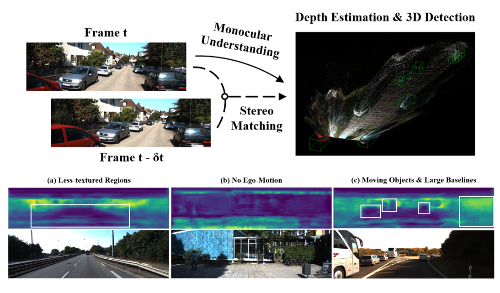

I am a Research Scientist at Embodied AI Center, [Shanghai AI Laboratory](https://www.shlab.org.cn/), and lead a team working on 3D Perception and Navigation Intelligence. My research focuses on constructing a foundation model that can understand our 3D world comprehensively (a.k.a. Spatial Intelligence), especially from ego-centric observations, and ultimately enabling general physical intelligence. In recent years, we have contributed several fundamental endeavors from general 3D perception ([Cylinder3D,](https://arxiv.org/abs/2011.10033) [FCOS3D,](https://arxiv.org/abs/2104.10956) [DfM](https://arxiv.org/abs/2207.12988)), embodied multi-modal 3D perception ([EmbodiedScan,](https://arxiv.org/abs/2312.16170) [PointLLM,](https://arxiv.org/abs/2308.16911) [LLaVA-3D](https://arxiv.org/abs/2409.18125)), to embodied interaction ([NavDP,](https://arxiv.org/abs/2505.08712) [GRUtopia](https://arxiv.org/abs/2407.10943)), with continuing open-source efforts ([MMDetection3D,](GitHub - open-mmlab/mmdetection3d: OpenMMLab's next-generation platform for general 3D object detect) [OpenRobotLab](OpenRobotLab)).

Working with [Dr. Jiangmiao Pang](https://oceanpang.github.io/), we are dedicated to building Embodied AGI systems and empowering academia and industry through open-source initiatives. If you are interested, please reach out to us for potential positions or collaborations.

I earned my Ph.D. degree from [MMLab](http://mmlab.ie.cuhk.edu.hk/), [The Chinese University of Hong Kong](https://www.cuhk.edu.hk/english/index.html), supervised by [Prof. Dahua Lin](http://dahua.site/). Before that, I received my B.Eng degree from [Zhejiang University](https://www.zju.edu.cn/english/) with the highest honors.

News
----------
- \[2025/06\] We release [NavDP](https://wzcai99.github.io/navigation-diffusion-policy.github.io/), [StreamVLN](https://streamvln.github.io/), [MMSI-Bench](https://runsenxu.com/projects/MMSI_Bench/) and [GLEAM](https://xiao-chen.tech/gleam/).
- \[2024/07\] We release [GRUtopia](https://github.com/OpenRobotLab/GRUtopia), [MMScan](https://tai-wang.github.io/mmscan/) and [Grounded 3D-LLM](https://groundedscenellm.github.io/grounded_3d-llm.github.io/).
- \[2024/03\] [EmbodiedScan](https://tai-wang.github.io/embodiedscan/) and [GenNBV](https://gennbv.tech/) are accepted by CVPR 2024. The Challenge [Server](https://huggingface.co/spaces/AGC2024/visual-grounding-2024) is online!
- \[2024/02\] We will host the Multi-View 3D Visual Grounding track in the [Autonomous Grand Challenge](https://opendrivelab.com/challenge2024/).
- \[2024/01\] [UniHSI](https://xizaoqu.github.io/unihsi/) is accepted by ICLR 2024 as Spotlight.
- \[2023/12\] We release [EmbodiedScan](https://tai-wang.github.io/embodiedscan/), the first ego-centric, multi-modal 3D perception suite for holistic 3D scene understanding.
- \[2023/08\] We release [PointLLM](https://runsenxu.com/projects/PointLLM/), the first work empowering LLMs to understand point clouds with solid evaluation and benchmarks.

Education
----------

&ensp;The Chinese University of Hong Kong (CUHK)
:   &nbsp;&ensp;August 2019 - July 2023
:   &nbsp;&ensp;Ph.D. in Information Engineering

&ensp;Zhejiang University (ZJU)
:   &nbsp;&ensp;August 2015 - July 2019
:   &nbsp;&ensp;Major: B.E. in Information Engineering
:   &nbsp;&ensp;Minor: Advanced Honor Class of Engineering Education (ACEE), Chu Kochen Honors College

Selected Publications
----------
**Navigation \& Exploration**  

&ensp;StreamVLN: Streaming Vision-and-Language Navigation via   &ensp;SlowFast Context Modeling
:   &nbsp;&ensp;Meng Wei\*, Chenyang Wan\*, Xiqian Yu\*, **Tai Wang\*‡**, et al.
:   &nbsp;&ensp;To be preprinted on arXiv
:   &nbsp;&ensp;[\[Project Page\]](https://streamvln.github.io/)&nbsp;\[Paper\]\(Coming Soon)&nbsp;\[Code\](Coming Soon)&nbsp;[\[Zhihu\]](https://zhuanlan.zhihu.com/p/1914387005099451505)

&ensp;NavDP: Learning Sim-to-Real Navigation Diffusion Policy with   &ensp;Privileged Information Guidance
:   &nbsp;&ensp;Wenzhe Cai, Jiaqi Peng, Yuqiang Yang, Yujian Zhang, ..., **Tai Wang\†**, Jiangmiao Pang†
:   &nbsp;&ensp;ArXiv preprint
:   &nbsp;&ensp;[\[Project Page\]](https://wzcai99.github.io/navigation-diffusion-policy.github.io/)&nbsp;[\[Paper\]](https://arxiv.org/abs/2505.08712)&nbsp;[\[Code\]](https://github.com/wzcai99/NavDP)&nbsp;[\[Zhihu\]](https://zhuanlan.zhihu.com/p/1914387005099451505)

&ensp;GLEAM: Learning Generalizable Exploration Policy for Active Mapping   &ensp;in Complex 3D Indoor Scenes
:   &nbsp;&ensp;Xiao Chen, Tai Wang, Quanyi Li, Tao Huang, Jiangmiao Pang, Tianfan Xue
:   &nbsp;&ensp;ArXiv preprint
:   &nbsp;&ensp;[\[Project Page\]](https://xiao-chen.tech/gleam/)&nbsp;[\[Paper\]](https://arxiv.org/abs/2505.20294)&nbsp;[\[Code\]](https://github.com/zjwzcx/GLEAM)

----------
**Embodied Multi-Modal 3D Perception**  

&ensp;MMSI-Bench: A Benchmark for Multi-Image Spatial Intelligence
:   &nbsp;&ensp;Sihan Yang\*, Runsen Xu\*‡, Yiman Xie, Sizhe Yang, ..., **Tai Wang\†**, Jiangmiao Pang†
:   &nbsp;&ensp;ArXiv preprint
:   &nbsp;&ensp;[\[Project Page\]](https://runsenxu.com/projects/MMSI_Bench/)&nbsp;[\[Paper\]](https://arxiv.org/abs/2505.23764)&nbsp;[\[Code\]](https://github.com/OpenRobotLab/MMSI-Bench)&nbsp;[\[中文解读\]](https://mp.weixin.qq.com/s/2YAvQeGib137tjfnULpRng)

&ensp;LLaVA-3D: A Simple yet Effective Pathway to Empowering LMMs   &ensp;with 3D-awareness
:   &nbsp;&ensp;Chenming Zhu, **Tai Wang†**, Wenwei Zhang, Jiangmiao Pang, Xihui Liu†
:   &nbsp;&ensp;ArXiv preprint
:   &nbsp;&ensp;[\[Project Page\]](https://zcmax.github.io/projects/LLaVA-3D/)&nbsp;[\[Paper\]](https://arxiv.org/abs/2409.18125)&nbsp;[\[Code\]](https://github.com/ZCMax/LLaVA-3D)

&ensp;MMScan: A Multi-Modal 3D Scene Dataset with Hierarchical   &ensp;Grounded Language Annotations
:   &nbsp;&ensp;Ruiyuan Lyu\*, **Tai Wang\***, Jingli Lin\*, Shuai Yang\*, et al.
:   &nbsp;&ensp;Conference on Neural Information Processing Systems (**NeurIPS**) 2024
:   &nbsp;&ensp;[\[Project Page\]](https://tai-wang.github.io/mmscan/)&nbsp;[\[Paper\]](https://arxiv.org/abs/2406.09401)&nbsp;[\[Code\]](https://github.com/OpenRobotLab/EmbodiedScan)

&ensp;Grounded 3D-LLM with Referent Tokens
:   &nbsp;&ensp;Yilun Chen\*, Shuai Yang\*, Haifeng Huang\*, **Tai Wang**, Ruiyuan Lyu, Runsen Xu, Dahua Lin, Jiangmiao Pang
:   &nbsp;&ensp;ArXiv preprint
:   &nbsp;&ensp;[\[Project Page\]](https://groundedscenellm.github.io/grounded_3d-llm.github.io/)&nbsp;[\[Paper\]](https://arxiv.org/abs/2405.10370)&nbsp;[\[Code\]](https://github.com/OpenRobotLab/Grounded_3D-LLM)

&ensp;Empowering 3D Visual Grounding with Reasoning Capabilities
:   &nbsp;&ensp;Chenming Zhu, **Tai Wang**, Wenwei Zhang, Kai Chen, Xihui Liu
:   &nbsp;&ensp;European Conference on Computer Vision (**ECCV**) 2024
:   &nbsp;&ensp;[\[Project Page\]](https://zcmax.github.io/projects/ScanReason/)&nbsp;[\[Paper\]](https://arxiv.org/abs/2407.01525)&nbsp;[\[Code\]](https://github.com/ZCMax/ScanReason)

&ensp;PointLLM: Empowering Large Language Models to Understand Point Clouds
:   &nbsp;&ensp;Runsen Xu, Xiaolong Wang, **Tai Wang†**, Yilun Chen, Jiangmiao Pang†, Dahua Lin
:   &nbsp;&ensp;European Conference on Computer Vision (**ECCV**) 2024, **Best Paper Candidate (all strong accept)**
:   &nbsp;&ensp;[\[Project Page\]](https://runsenxu.com/projects/PointLLM/)&nbsp;[\[Paper\]](https://arxiv.org/abs/2308.16911)&nbsp;[\[Code\]](https://github.com/OpenRobotLab/PointLLM)

&ensp;EmbodiedScan: A Holistic Multi-Modal 3D Perception Suite   &ensp;Towards Embodied AI
:   &nbsp;&ensp;**Tai Wang\***, Xiaohan Mao\*, Chenming Zhu\*, et al.
:   &nbsp;&ensp;IEEE Conference on Computer Vision and Pattern Recognition (**CVPR**) 2024
:   &nbsp;&ensp;[\[Project Page\]](https://tai-wang.github.io/embodiedscan/)&nbsp;[\[Paper\]](https://arxiv.org/abs/2312.16170)&nbsp;[\[Code\]](https://github.com/OpenRobotLab/EmbodiedScan)&nbsp;[\[中文解读\]](https://mp.weixin.qq.com/s/__cubd_YlvZrTvDHyLI-ow)

----------
**Embodied Interaction \& Simulation**  

&ensp;CooHOI: Learning Cooperative Human-Object Interaction with   &ensp;Manipulated Object Dynamics
:   &nbsp;&ensp;Jiawei Gao, Ziqin Wang, Zeqi Xiao, Jingbo Wang, **Tai Wang**, et al.
:   &nbsp;&ensp;Conference on Neural Information Processing Systems (**NeurIPS**) 2024, **Spotlight**
:   &nbsp;&ensp;[\[Paper\]](https://arxiv.org/abs/2406.14558)&nbsp;\[Code\](Coming Soon)

&ensp;GRUtopia: Dream General Robots in a City at Scale
:   &nbsp;&ensp;Hanqing Wang\*, Jiahe Chen\*, Wensi Huang\*, Qingwei Ben\*, **Tai Wang\***, Boyu Mi\*, et al.
:   &nbsp;&ensp;ArXiv preprint
:   &nbsp;&ensp;[\[Project Page\]](https://github.com/OpenRobotLab/GRUtopia)&nbsp;[\[Paper\]](https://arxiv.org/abs/2407.10943)&nbsp;[\[Code\]](https://github.com/OpenRobotLab/GRUtopia)&nbsp;[\[Doc\]](https://grutopia.github.io/)&nbsp;[\[Youtube\]](https://www.youtube.com/watch?v=fD0F1jIax5Y)&nbsp;[\[bilibili\]](https://www.bilibili.com/video/BV1JUbxeMEsL/?buvid=XU42709457560E0722A8AA591EE792A3DAE59&from_spmid=search.search-result.0.0&is_story_h5=false&mid=vxiHfNKVdk6fb8fduRusuX8FTQ%2FSZMtL1rElX6M3iMo%3D&p=1&plat_id=116&share_from=ugc&share_medium=android&share_plat=android&share_session_id=e78b4bb6-087b-4a72-817b-b06ef91167f3&share_source=COPY&share_tag=s_i&spmid=united.player-video-detail.0.0&timestamp=1720788955&unique_k=CeKgxGI&up_id=3546722198358311&vd_source=7f685cd616faf836ed7469749c100410)

&ensp;UniHSI: Unified Human-Scene Interaction via Prompted Chain-of-Contacts
:   &nbsp;&ensp;Zeqi Xiao, **Tai Wang**, Jingbo Wang, Jinkun Cao, Wenwei Zhang, Bo Dai, Dahua Lin, Jiangmiao Pang
:   &nbsp;&ensp;International Conference on Learning Representations (**ICLR**) 2024, **Spotlight**
:   &nbsp;&ensp;[\[Project Page\]](https://xizaoqu.github.io/unihsi/)&nbsp;[\[Paper\]](https://arxiv.org/abs/2309.07918)&nbsp;[\[Code\]](https://github.com/OpenRobotLab/UniHSI)

----------
**Vision-Based 3D Perception**  

&ensp;DORT: Modeling Dynamic Objects in Recurrent for Multi-Camera   &ensp;3D Object Detection and Tracking
:   &nbsp;&ensp;Qing Lian, **Tai Wang**, Jiangmiao Pang, Dahua Lin
:   &nbsp;&ensp;Conference on Robot Learning (**CoRL**) 2023
:   &nbsp;&ensp;[\[Paper\]](https://arxiv.org/abs/2303.16628)&nbsp;[\[Code\]](https://github.com/SmartBot-PJLab/DORT)

&ensp;Vision-Centric BEV Perception: A Survey
:   &nbsp;&ensp;Yuexin Ma\*, **Tai Wang\***, Xuyang Bai\*, Huitong Yang, Yuenan Hou, Yaming Wang,   &ensp; Yu Qiao, Ruigang Yang, Dinesh Manocha, Xinge Zhu
:   &nbsp;&ensp;IEEE Transactions on Pattern Analysis and Machine Intelligence (**TPAMI**) 2024
:   &nbsp;&ensp;[\[Paper\]](https://arxiv.org/abs/2208.02797)&nbsp;[\[Code\]](https://github.com/4DVLab/Vision-Centric-BEV-Perception)

&ensp;Scene as Occupancy
:   &nbsp;&ensp;Chonghao Sima\*, Wenwen Tong\*, **Tai Wang**, Li Chen, Silei Wu, Hanming Deng, Yi Gu, Lewei Lu,   &ensp; Ping Luo, Dahua Lin, Hongyang Li
:   &nbsp;&ensp;End-to-End Autonomous Driving, CVPR 2023 Workshop and Challenge
:   &nbsp;&ensp;IEEE/CVF International Conference on Computer Vision (**ICCV**) 2023
:   &nbsp;&ensp;[\[Paper\]](https://arxiv.org/abs/2306.02851)&nbsp;[\[Code\]](https://github.com/OpenDriveLab/OccNet)

&ensp;Monocular 3D Object Detection with Depth from Motion
:   &nbsp;&ensp;**Tai Wang**, Jiangmiao Pang, Dahua Lin
:   &nbsp;&ensp;European Conference on Computer Vision (**ECCV**) 2022, **Oral**
:   &nbsp;&ensp;[\[Paper\]](https://arxiv.org/abs/2207.12988)&nbsp;[\[Code\]](https://github.com/Tai-Wang/Depth-from-Motion)

&ensp;Probabilistic and Geometric Depth: Detecting Objects in Perspective
:   &nbsp;&ensp;**Tai Wang**, Xinge Zhu, Jiangmiao Pang, Dahua Lin
:   &nbsp;&ensp;Conference on Robot Learning (**CoRL**) 2021
:   &nbsp;&ensp;[\[Paper\]](https://arxiv.org/abs/2107.14160)&nbsp;[\[Code\]](https://github.com/open-mmlab/mmdetection3d)&nbsp;[\[Poster\]](https://openreview.net/attachment?id=bEito8UUUmf&name=poster)

&ensp;FCOS3D: Fully Convolutional One-Stage Monocular 3D Object Detection
:   &nbsp;&ensp;**Tai Wang**, Xinge Zhu, Jiangmiao Pang, Dahua Lin
:   &nbsp;&ensp;ICCV Workshop on 3D Object Detection from Images (**ICCVW**) 2021, **Best Paper Award**
:   &nbsp;&ensp;1st place solution of vision-only methods in the nuScenes 3D detection challenge, **NeurIPS** 2020
:   &nbsp;&ensp;[\[Paper\]](https://arxiv.org/abs/2104.10956)&nbsp;[\[Code\]](https://github.com/open-mmlab/mmdetection3d)&nbsp;[\[Slides\]](https://drive.google.com/file/d/1mcOxavQetj0CCdP__5XQK_RZB6-VT32u/view?usp=sharing)&nbsp;[\[Zhihu\]](https://zhuanlan.zhihu.com/p/400191167)

----------
**Voxel Representation Learning in LiDAR-Based Perception**  

&ensp;Position-Guided Point Cloud Panoptic Segmentation Transformer
:   &nbsp;&ensp;Zeqi Xiao\*, Wenwei Zhang\*, **Tai Wang\***, Chen Change Loy, Dahua Lin, Jiangmiao Pang
:   &nbsp;&ensp;International Journal of Computer Vision (**IJCV**) 2024
:   &nbsp;&ensp;[\[Paper\]](https://arxiv.org/abs/2303.13509)&nbsp;[\[Code\]](https://github.com/SmartBot-PJLab/P3Former)

&ensp;Cylindrical and Asymmetrical 3D Convolution Networks for   &ensp;LiDAR Segmentation
:   &nbsp;&ensp;Xinge Zhu\*, Hui Zhou\*, **Tai Wang**, Fangzhou Hong, Yuexin Ma, Wei Li, Hongsheng Li, Dahua Lin
:   &nbsp;&ensp;IEEE Conference on Computer Vision and Pattern Recognition (**CVPR**) 2021, **Oral**
:   &nbsp;&ensp;IEEE Transactions on Pattern Analysis and Machine Intelligence (**TPAMI**) 2021
:   &nbsp;&ensp;[\[Paper\]](https://openaccess.thecvf.com/content/CVPR2021/papers/Zhu_Cylindrical_and_Asymmetrical_3D_Convolution_Networks_for_LiDAR_Segmentation_CVPR_2021_paper.pdf)&nbsp;[\[Code\]](https://github.com/xinge008/Cylinder3D)&nbsp;[\[TPAMI version\]](https://ieeexplore.ieee.org/document/9495168)&nbsp;[\[Bibtex\]](https://drive.google.com/file/d/1AiNyWAdGG4vcljsuzByeivjcLG8BtK_o/view?usp=sharing)

&ensp;Reconfigurable Voxels: A New Representation for LiDAR-Based   &ensp;Point Clouds
:   &nbsp;&ensp;**Tai Wang**, Xinge Zhu, Dahua Lin
:   &nbsp;&ensp;Conference on Robot Learning (**CoRL**) 2020
:   &nbsp;&ensp;[\[Paper\]](https://arxiv.org/abs/2004.02724)&nbsp;[\[Spotlight Talk\]](https://www.youtube.com/watch?v=qooEVl8XF9o&t=4s)

----------
**Efficient Annotation of LiDAR Point Clouds**  

&ensp;FLAVA: Find, Localize, Adjust and Verify to Annotate LiDAR-based   &ensp;Point Clouds
:   &nbsp;&ensp;**Tai Wang**, Conghui He, Zhe Wang, Jianping Shi, Dahua Lin
:   &nbsp;&ensp;ACM Symposium on User Interface Software and Technology (**UIST**) 2020, Poster
:   &nbsp;&ensp;[\[Full Tech Report\]](https://arxiv.org/abs/2011.10174)&nbsp;[\[Poster\]](https://uist.acm.org/uist2020/data/posters/1024.pdf)&nbsp;[\[Poster Summary\]](https://dl.acm.org/doi/10.1145/3379350.3416176)&nbsp;[\[Demo\]](https://www.youtube.com/watch?v=hri54dzPxnI)

Research Projects
----------

&ensp;MMDetection3D: The Next-Generation Platform for General 3D Detection
:   &nbsp;&ensp;A versatile, open-source 3D object detection toolbox based on PyTorch
:   &nbsp;&ensp;MMDetection3D Contributors
:   &nbsp;&ensp;May 2020 – Now
:   &nbsp;&ensp;[\[Code\]](https://github.com/open-mmlab/mmdetection3d)&nbsp;[\[Doc\]](https://mmdetection3d.readthedocs.io/en/latest/)&nbsp;[\[Bibtex\]](https://drive.google.com/file/d/1X24zBeM0dwol10CcKSN_SkIolhopsA85/view?usp=sharing)

Selected Awards
----------
- Runner-up of [Waymo Camera-Only 3D Detection Challenge](https://cvpr2022.wad.vision/), CVPR 2022
- Best Paper Award of [Workshop on 3D Object Detection from Images](https://sites.google.com/unitn.it/3dodi/home), ICCV 2021
- 1st place of vision-only track and best PKL award of overall track, [NuScenes 3D Detection Challenge](https://www.nuscenes.org/object-detection?externalData=all&mapData=all&modalities=Any), NeurIPS 2020
- Runner-up of [NuScenes LiDAR Segmentation Challenge](https://www.nuscenes.org/lidar-segmentation?externalData=all&mapData=all&modalities=Any), NeurIPS 2020
- Gold Medal of Kaggle Competition (Top 1% of [Lyft 3D Detection Challenge](https://www.nuscenes.org/lidar-segmentation?externalData=all&mapData=all&modalities=Any)), NeurIPS 2019
- Hong Kong PhD Fellowship (HKPFS), 2019
- Chu Kochen Scholarship (Highest scholarship at Zhejiang University), 2018
- Top 10 Students of ZJU (Highest honor for 5 undergraduates/graduates), 2018
- National Scholarship (1.5%), 2017-2018
- First Prize in Physics Competition for Undergraduate, 2017

Teaching
----------
- Computer Vision (Undergraduate Course), Winter 2018 @ ZJU
- IERG2080: Introduction to Systems Programming, Fall 2020 @ CUHK
- IERG2470B/ESTR2308: Probability Models and Applications (Elite Students), Spring 2021 @ CUHK

Miscellaneous
----------
**Academic Services**  
I served as a reviewer for CVPR, ICCV, ECCV, CoRL, NeurIPS, ICLR, ICML, WACV, TPAMI, IJCV, TVCG.

**Hobbies**  
Love: 🏀Basketball (I am a big fan of [Stephen Curry](https://en.wikipedia.org/wiki/Stephen_Curry) and [Tracy McGrady](https://en.wikipedia.org/wiki/Tracy_McGrady)), 🎵music/🎤singing and good at 🖌️Chinese calligraphy (learned from [MA Liangchen](https://baike.baidu.com/item/%E9%A9%AC%E8%89%AF%E8%BE%B0/5438872) and [MA Shanshuang](https://baike.baidu.com/item/%E9%A9%AC%E5%96%84%E5%8F%8C/5954206)).
